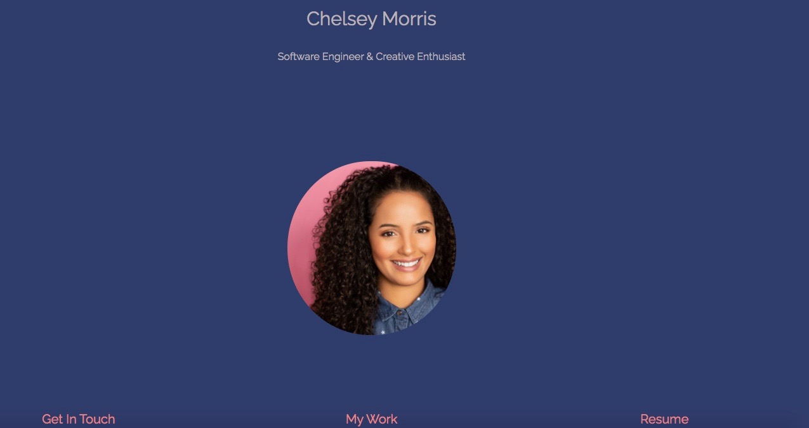
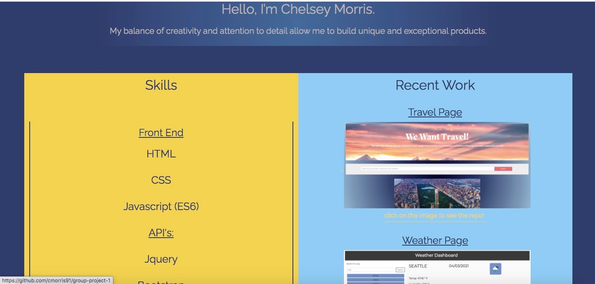
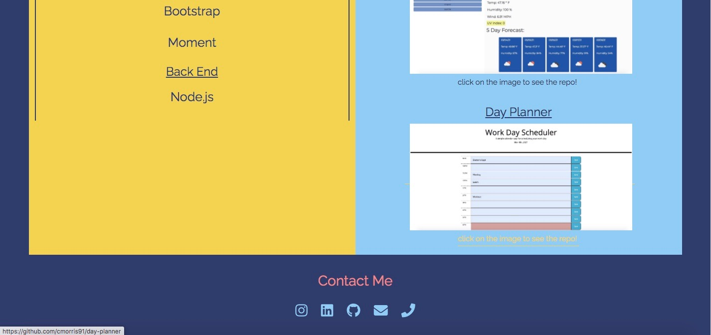

# Portfolio-homework

Created Student Portfolio using HTML and CSS.  

Includes:
-Photo of myself
-Bio
-Projects I'm proud of and the links to the deployed version and the github repositories
-Contact Me section which includes:
    link to linkedIn
    link to Github
    link to Instagram
    link to email
    phone number
-Links in Nav bar that connect to different sections of the page

-Hover attributes for buttons

-Mobile responsive design
-Downloadable version of resume

# links
Deployed:
https://cmorris91.github.io/Portfolio-homework/

Repo:
https://github.com/cmorris91/Portfolio-homework

